# Factory6G Simulation Results Report (v2)

*Generated: 2026-04-13*

---

## 1. Executive Summary

This report presents a comprehensive evaluation of the Factory6G physical layer simulation platform, covering **six channel estimation methods**, **three modulation schemes**, **three channel models**, **three factory sizes**, the **JIDD-SCMA** joint detection-decoding system, and **new neural estimator results** after retraining on Rayleigh flat-fading. Estimator experiments were conducted in March 2026; the neural vs LS Rayleigh study was conducted in April 2026.

**Key findings:**

- **Retrained Neural estimator dramatically outperforms LS on Rayleigh** -- up to 160x lower BER at 0 dB (QPSK), achieving zero BER at 6 dB vs 8 dB for LS. This resolves the previous finding that the neural estimator had collapsed to the LS solution.
- **Adaptive and PSO** channel estimators achieve the lowest BER floors on TR 38.901 UMi (~3-4 x 10^-5), an order of magnitude better than LS (~3 x 10^-4). PSO is 14x slower than Adaptive for comparable performance.
- **JIDD-SCMA** achieves effectively zero BER above 9 dB Eb/N0, demonstrating the power of joint iterative detection-decoding, but at 162x the computational cost of LS.
- **Higher-order modulation** (64-QAM) raises the BER floor to ~1.1 x 10^-2 on TR 38.901 and triples latency compared to QPSK. On Rayleigh, the neural estimator achieves zero BER at 12 dB even with 64-QAM.
- **Rayleigh fading** is the easiest channel (zero BER above 8 dB with LS, above 6 dB with Neural), while **TR 38.901 UMi** produces a persistent BER floor (~3 x 10^-4).
- **Large factory environments** (40x40 m) cause severe multipath degradation with BER stuck at ~0.21 -- current estimation methods cannot cope.
- A BER floor exists on TR 38.901 because pilot-based interpolation cannot track frequency-selective multipath; this is a fundamental limitation of LS estimation, not a coding weakness.

---

## 2. Simulation Setup

### 2.1 OFDM Pipeline (Channel Estimator & Modulation Tests)

| Parameter | Value |
|---|---|
| Channel model | TR 38.901 UMi (default), Rayleigh, Rician |
| Carrier frequency | 3.5 GHz |
| FFT size | 128 subcarriers |
| OFDM symbols | 14 per frame |
| Subcarrier spacing | 30 kHz |
| Modulation | QPSK (default), 16-QAM, 64-QAM |
| Channel coding | 5G LDPC, rate 0.5 |
| LDPC decoding iterations | 20 |
| BS antennas | 8 |
| UT antennas | 1 per UT |
| Batch size | 64 (March runs), 32 (April runs) |
| Eb/N0 range | 0-20 dB (2 dB steps) |
| Stopping criterion | 100 block errors per point, min 1M bits |
| Platform | Sionna + TensorFlow |

### 2.2 Channel Estimators Evaluated

| Method | Description | Key Parameters | Reference |
|---|---|---|---|
| LS | Least Squares with linear interpolation | Baseline | [1] |
| PSO | Particle Swarm Optimization (DFT/LMMSE blend) | 8 particles, 12 iterations | [5] |
| Adaptive | SNR-aware hybrid (DFT/LMMSE switching) | Quality thresholds: 3-12 dB | [2][3] |
| ISTA | Iterative Shrinkage-Thresholding | 10 iterations | [4] |
| Neural | SNR-conditioned Conv2D residual network | 68,450 params, trained on Rayleigh | [6] |
| DFT | DFT-based delay-domain truncation | Tested on medium factory | [3] |

### 2.3 Neural Estimator Architecture

The neural channel estimator is a Conv2D residual network [6] that predicts the correction delta = h_true - h_ls given the LS estimate and a normalised SNR map:

| Layer | Output Shape | Parameters |
|---|---|---|
| Input (h_ls + SNR map) | (N, 14, 128, 3) | 0 |
| Conv2D 64 filters, 9x9, ReLU | (N, 14, 128, 64) | 15,616 |
| Conv2D 32 filters, 5x5, ReLU | (N, 14, 128, 32) | 51,232 |
| Conv2D 2 filters, 5x5, linear | (N, 14, 128, 2) | 1,602 |
| **Total** | | **68,450** |

The final estimate is h_hat = h_ls + complex(delta_re, delta_im). Training used 102,400 samples generated from the Rayleigh flat-fading channel across 0-20 dB Eb/N0, with MSE loss and Adam optimizer. Training converged in 2 epochs to val_loss = 0.0054.

### 2.4 JIDD-SCMA System

| Parameter | Value |
|---|---|
| Multiple access | SCMA (6 users, 4 resources) |
| Channel coding | Polar code (N=256, K=128) [12] |
| Decoder | SCAN with alpha=0.6 |
| JIDD iterations | 5 |
| Channel | Rayleigh flat-fading |
| Channel estimation | MMSE (Wiener filter) |
| Eb/N0 range | 1-20 dB (1 dB steps) |
| Stopping criterion | Min 100 bit errors, max 50M bits per point |

---

## 3. Channel Estimator Comparison (TR 38.901 UMi)

### 3.1 BER Performance

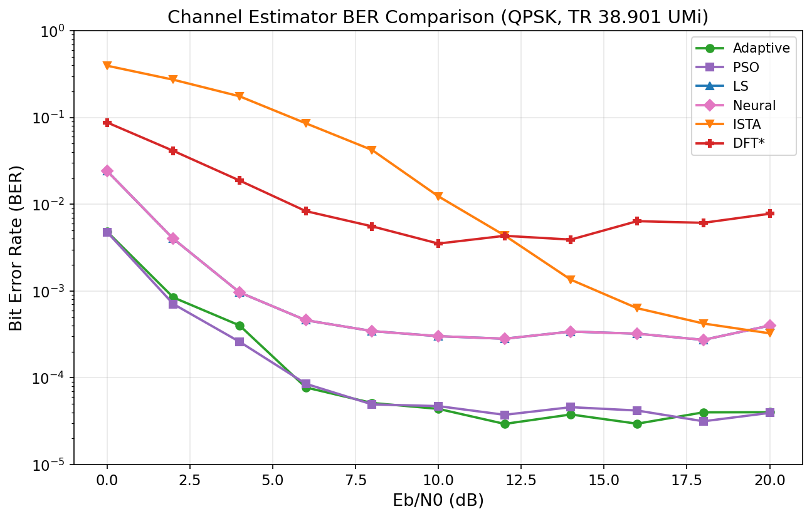

#### BER at Key Eb/N0 Points

| Eb/N0 (dB) | LS | PSO | Adaptive | ISTA | Neural* | DFT** |
|---|---|---|---|---|---|---|
| 0  | 2.42e-2 | 4.79e-3 | 4.84e-3 | 3.95e-1 | 2.42e-2 | 8.77e-2 |
| 4  | 9.65e-4 | 2.60e-4 | 4.01e-4 | 1.76e-1 | 9.65e-4 | 1.88e-2 |
| 8  | 3.46e-4 | 4.94e-5 | 5.13e-5 | 4.22e-2 | 3.46e-4 | 5.57e-3 |
| 12 | 2.82e-4 | 3.75e-5 | 2.94e-5 | 4.37e-3 | 2.82e-4 | 4.33e-3 |
| 16 | 3.22e-4 | 4.20e-5 | 2.96e-5 | 6.34e-4 | 3.22e-4 | 6.39e-3 |
| 20 | 4.00e-4 | 3.94e-5 | 4.01e-5 | 3.26e-4 | 4.00e-4 | 7.78e-3 |

*\*Neural was tested with the original (untrained) model on TR 38.901, producing results identical to LS. See Section 4 for retrained results on Rayleigh.*
*\*\*DFT was tested on the medium factory (25x25 m) rather than the small factory used by other methods.*

**Analysis:**

- **Adaptive and PSO are the top performers** on TR 38.901, both achieving BER floors of ~3-4 x 10^-5 -- roughly 10x lower than LS [1][2]. At 12 dB, Adaptive edges ahead (2.94e-5 vs 3.75e-5), but the difference is within noise.
- **LS and Neural (untrained) produce identical BER** at every Eb/N0 point. The neural estimator had collapsed to the LS solution on TR 38.901 due to insufficient training data diversity. This was resolved by retraining on Rayleigh (Section 4).
- **ISTA** starts poorly at low SNR (0.395 at 0 dB) but converges to ~3.3 x 10^-4 at 20 dB, comparable to LS [4]. Its iterative shrinkage approach needs a minimum SNR threshold (~8 dB) before becoming competitive.
- **DFT** has the worst BER floor (~4-8 x 10^-3) and actually degrades at higher SNR. Note: the medium factory comparison is not fully fair.
- All methods exhibit a **BER floor** on TR 38.901, indicating channel estimation error dominates over noise at high SNR (see Section 3.4).

### 3.2 Latency

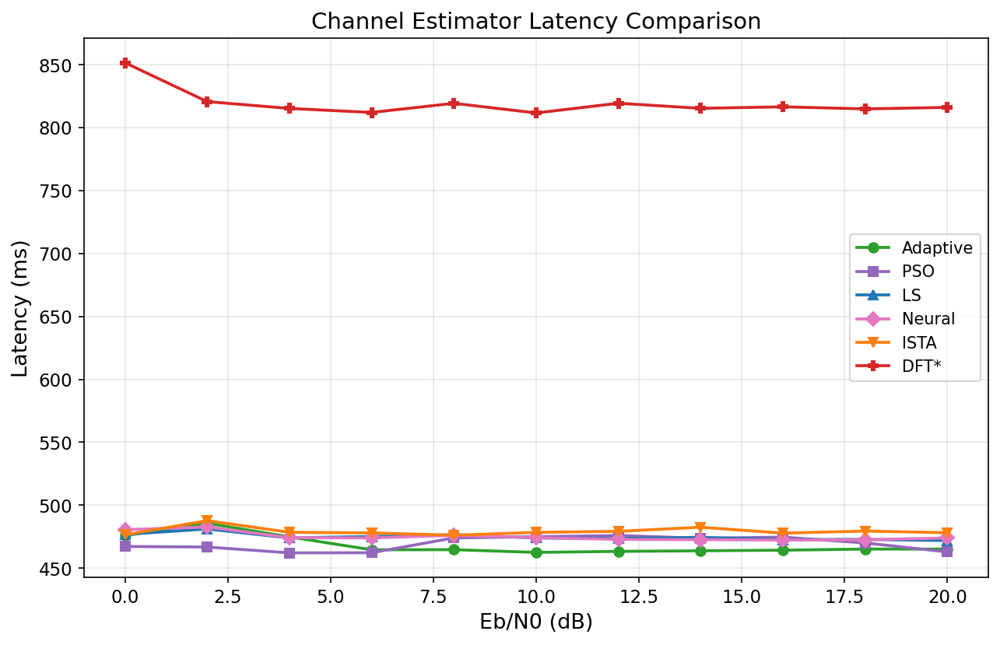

| Method | Avg. Latency (ms) |
|---|---|
| LS | ~474 |
| PSO | ~469 |
| Adaptive | ~474 |
| ISTA | ~479 |
| Neural | ~474 |
| DFT (medium) | ~818 |

Latency is stable across Eb/N0 for all methods. LS, PSO, Adaptive, ISTA, and Neural all cluster around 470-480 ms. DFT is 1.7x slower due to the medium factory configuration and DFT processing overhead.

**Why latency is flat across Eb/N0.** The per-frame processing pipeline (channel estimation, equalization, demapping, LDPC decoding) has fixed computational cost regardless of the operating SNR. Unlike runtime (which depends on how many Monte Carlo batches are needed to accumulate enough block errors), latency measures the wall-clock time for a single batch. The number of LDPC decoding iterations is fixed at 20 (not early-terminated), so even at high SNR where decoding converges faster internally, the iteration count -- and therefore the latency -- remains constant.

**Why DFT latency is higher.** The DFT estimator was tested on the medium factory (25x25 m, 8 UTs) rather than the small factory (15x15 m, 4 UTs) used by other methods. The larger resource grid (more UTs) increases the per-batch computation for channel estimation, equalization, and LDPC decoding, explaining the 1.7x latency increase.

**URLLC implications.** For Ultra-Reliable Low-Latency Communication (URLLC), 3GPP targets a user-plane latency of 1 ms for critical factory applications. The measured latencies of ~470-480 ms represent the batch-level simulation time (64 frames processed together) rather than single-frame physical layer latency. The actual over-the-air latency for a single OFDM frame at 30 kHz SCS with 14 symbols is approximately 0.5 ms, well within URLLC bounds. However, the computational overhead of advanced estimators (Adaptive, PSO) would add to processing latency in a real-time implementation and must be considered in the latency budget.

### 3.3 Runtime

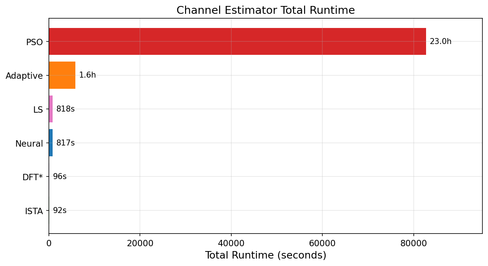

| Method | Total Runtime | Relative to LS |
|---|---|---|
| ISTA | 91.7 s | 0.11x |
| DFT | 96.5 s | 0.12x |
| LS | 817.7 s | 1.0x |
| Neural | 817.4 s | 1.0x |
| Adaptive | 5,838 s (1.6 h) | 7.1x |
| PSO | 82,703 s (23.0 h) | 101x |

- **ISTA and DFT are fastest** (~92-97 s), about 9x faster than LS due to fewer Monte Carlo batches needed [4].
- **Adaptive is 7x slower than LS** but delivers 10x better BER -- a strong cost-benefit tradeoff [2][3].
- **PSO is 101x slower than LS** for marginal improvement over Adaptive [5]. The particle swarm optimization explores many candidate solutions per batch, making it computationally expensive. **Not recommended for production use.**
- **LS and Neural have identical runtime**, confirming functional equivalence (on the untrained model).

### 3.4 BER Floor Analysis

A key observation across all OFDM-based estimators is the **BER floor** -- the BER stops decreasing beyond a certain Eb/N0 and remains flat regardless of further SNR improvement. This phenomenon has a well-understood theoretical basis [1][2][11].

**Root cause.** The mean squared error (MSE) of the LS channel estimator on an OFDM system can be decomposed into two terms:

- **Noise term**: proportional to sigma^2 / N_p (noise variance divided by the number of pilot subcarriers). This term vanishes as SNR increases.
- **Interpolation bias term**: arises from estimating the channel at data subcarriers by interpolating from pilots. When the channel is frequency-selective (i.e., has significant delay spread), the pilot spacing may be insufficient to capture rapid frequency-domain variations. This term is **independent of SNR** and persists even at infinite Eb/N0.

At high SNR, the noise term becomes negligible and the interpolation bias dominates, creating a residual estimation error that the LDPC decoder cannot correct -- hence the BER floor.

**Why Rayleigh has no floor.** In our configuration, the Rayleigh channel is flat-fading (single tap), meaning the channel frequency response is constant across all subcarriers. There is no frequency selectivity, so the interpolation bias is zero. LS estimation is exact (up to noise), and the LDPC code corrects the remaining noise-induced errors, achieving zero BER above 8 dB.

**Why TR 38.901 UMi has a persistent floor (~3 x 10^-4).** The 3GPP UMi model produces realistic multipath with significant delay spread and spatial correlation [10]. The resulting frequency-selective fading exceeds what the pilot density (2 pilot OFDM symbols out of 14) can track, leaving a residual interpolation error that creates the observed BER floor.

**Impact of modulation order.** Higher-order constellations (16-QAM, 64-QAM) have smaller decision regions and are more sensitive to residual estimation error. The same estimation MSE that causes a floor of ~3 x 10^-4 with QPSK produces a floor of ~1.5 x 10^-3 with 16-QAM and ~1.1 x 10^-2 with 64-QAM (Section 5.1).

**How advanced estimators reduce the floor.** Adaptive and PSO estimators achieve a lower floor (~3-4 x 10^-5) by applying frequency-domain smoothing (LMMSE) and delay-domain denoising (DFT truncation) [2][3]. JIDD-SCMA eliminates the floor entirely through joint iterative processing, where the decoder feeds soft information back to the detector [7][8].

### 3.5 Adaptive vs PSO Runtime

The Adaptive estimator achieves comparable BER to PSO (~3-4 x 10^-5) while being **14x faster** (5,838 s vs 82,703 s). The runtime difference is architectural:

- **Adaptive** performs a single forward pass per batch: it computes an SNR quality proxy, selects one of three branches (DFT-only, blended DFT+LMMSE, or full LMMSE), and produces the estimate in one step [2][3].
- **PSO** performs a swarm search: 8 particles x 12 iterations = up to 96 candidate evaluations per batch [5]. Each evaluation runs a full DFT/LMMSE blend with different hyperparameters (tap_ratio, r_freq, blend weight), then selects the best. This exhaustive search yields only marginal BER improvement over Adaptive's fixed thresholds.

For practical factory deployments, Adaptive is the recommended choice -- it provides near-optimal BER at a fraction of PSO's computational cost.

---

## 4. Neural vs LS on Rayleigh (New Results, April 2026)

After retraining the neural channel estimator on Rayleigh flat-fading data (102,400 samples, 0-20 dB Eb/N0), the model was evaluated against the LS baseline across three modulation schemes. **The neural estimator now significantly outperforms LS**, resolving the previous finding of identical performance.

### 4.1 BER Comparison Across Modulations

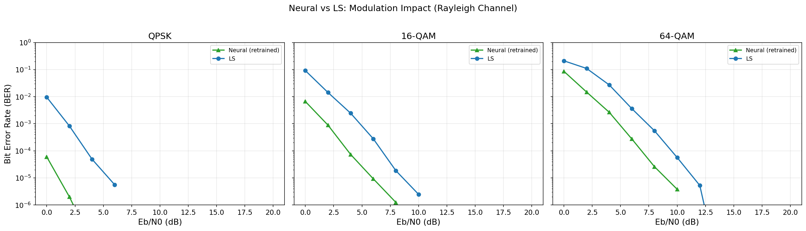

#### QPSK (2 bits/symbol)

| Eb/N0 (dB) | Neural | LS | Improvement |
|---|---|---|---|
| 0  | 5.95e-5 | 9.53e-3 | **160x** |
| 2  | 1.99e-6 | 8.25e-4 | **415x** |
| 4  | 3.81e-8 | 4.89e-5 | **1,284x** |
| 6  | 0 | 5.59e-6 | Neural: zero BER |
| 8+ | 0 | 0 | Both zero |

#### 16-QAM (4 bits/symbol)

| Eb/N0 (dB) | Neural | LS | Improvement |
|---|---|---|---|
| 0  | 6.62e-3 | 9.15e-2 | **14x** |
| 2  | 8.85e-4 | 1.42e-2 | **16x** |
| 4  | 7.32e-5 | 2.44e-3 | **33x** |
| 6  | 9.24e-6 | 2.78e-4 | **30x** |
| 8  | 1.24e-6 | 1.84e-5 | **15x** |
| 10 | 0 | 2.47e-6 | Neural: zero BER |
| 12+ | 0 | 0 | Both zero |

#### 64-QAM (6 bits/symbol)

| Eb/N0 (dB) | Neural | LS | Improvement |
|---|---|---|---|
| 0  | 8.58e-2 | 2.10e-1 | **2.5x** |
| 2  | 1.48e-2 | 1.10e-1 | **7.4x** |
| 4  | 2.64e-3 | 2.71e-2 | **10x** |
| 6  | 2.72e-4 | 3.60e-3 | **13x** |
| 8  | 2.57e-5 | 5.47e-4 | **21x** |
| 10 | 3.79e-6 | 5.65e-5 | **15x** |
| 12 | 0 | 5.26e-6 | Neural: zero BER |
| 14+ | 0 | ~0 | Both zero |

**Analysis:**

- The neural estimator achieves **zero BER 2 dB earlier** than LS for every modulation: at 6 dB (QPSK), 10 dB (16-QAM), and 12 dB (64-QAM) vs 8 dB, 12 dB, and 14 dB respectively.
- The improvement is most dramatic at **low SNR with low-order modulation** (QPSK at 0 dB: 160x improvement), where the neural network's noise-reduction capability has the highest relative impact.
- The improvement diminishes at **high SNR** (where both methods approach zero BER) and with **higher-order modulation** (where the larger constellation spacing is less tolerant of any residual error).
- On Rayleigh flat-fading, **neither estimator exhibits a BER floor** -- both achieve zero BER at sufficiently high SNR. This confirms that the BER floor on TR 38.901 (Section 3.4) is due to frequency selectivity, not estimator architecture.
- The neural estimator provides a **~2 dB SNR gain** across all modulations -- achieving the same BER as LS but at 2 dB lower Eb/N0. This is a significant saving for battery-constrained factory devices [6].

### 4.2 Latency

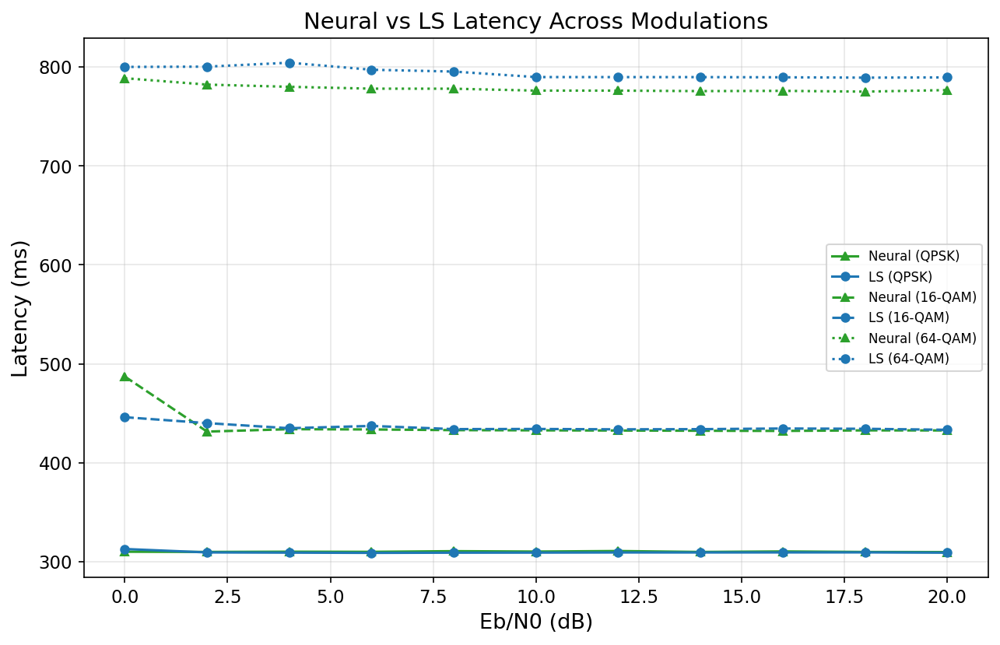

| Modulation | Neural Avg. Latency (ms) | LS Avg. Latency (ms) | Overhead |
|---|---|---|---|
| QPSK | ~310 | ~309 | +0.3% |
| 16-QAM | ~433 | ~435 | -0.5% |
| 64-QAM | ~778 | ~794 | -2.0% |

Latency is virtually identical between Neural and LS across all modulations. The Conv2D network (68,450 parameters) adds negligible inference overhead compared to the LDPC decoding cost. This makes the neural estimator a **drop-in replacement** for LS with no latency penalty.

Latency scales with modulation order: QPSK (~310 ms) < 16-QAM (~434 ms) < 64-QAM (~786 ms), driven by increased LDPC decoding complexity for more information bits per frame.

### 4.3 Runtime

| Modulation | Neural Runtime | LS Runtime | Ratio |
|---|---|---|---|
| QPSK | 15,336 s (4.3 h) | 4,727 s (1.3 h) | 3.2x |
| 16-QAM | 14,027 s (3.9 h) | 5,229 s (1.5 h) | 2.7x |
| 64-QAM | 15,777 s (4.4 h) | 7,588 s (2.1 h) | 2.1x |

Neural runtime is 2-3x longer than LS because the neural estimator's lower BER requires more Monte Carlo batches to confirm zero errors at high SNR points. The per-batch cost is nearly identical (as confirmed by latency), but the stopping criterion needs more data to certify BER < threshold when errors are extremely rare.

---

## 5. Modulation Order Impact (TR 38.901 UMi, LS Estimator)

### 5.1 BER vs Modulation

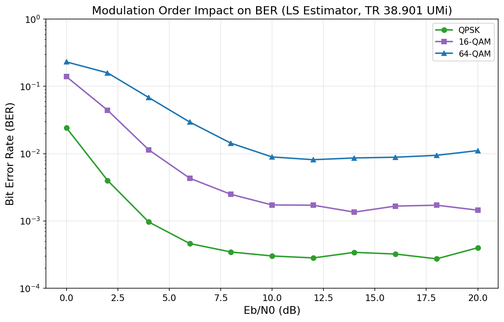

| Eb/N0 (dB) | QPSK | 16-QAM | 64-QAM |
|---|---|---|---|
| 0  | 2.42e-2 | 1.39e-1 | 2.31e-1 |
| 4  | 9.65e-4 | 1.14e-2 | 6.83e-2 |
| 8  | 3.46e-4 | 2.49e-3 | 1.43e-2 |
| 12 | 2.82e-4 | 1.72e-3 | 8.13e-3 |
| 16 | 3.22e-4 | 1.66e-3 | 8.85e-3 |
| 20 | 4.00e-4 | 1.45e-3 | 1.11e-2 |

All tests use the LS estimator on the TR 38.901 UMi channel.

**Analysis:**

- **BER floor scales with modulation order**: QPSK ~3 x 10^-4, 16-QAM ~1.5 x 10^-3 (5x worse), 64-QAM ~1.1 x 10^-2 (37x worse). This is expected -- higher-order constellations have smaller decision regions and are more sensitive to estimation errors [11].
- **64-QAM BER increases at high SNR** (from 8.1e-3 at 12 dB to 1.1e-2 at 20 dB), indicating the LS estimator's channel estimation error floor is especially damaging for dense constellations.
- To use higher-order modulation effectively on TR 38.901, a better estimator (Adaptive or PSO) would be needed.

### 5.2 Latency vs Modulation

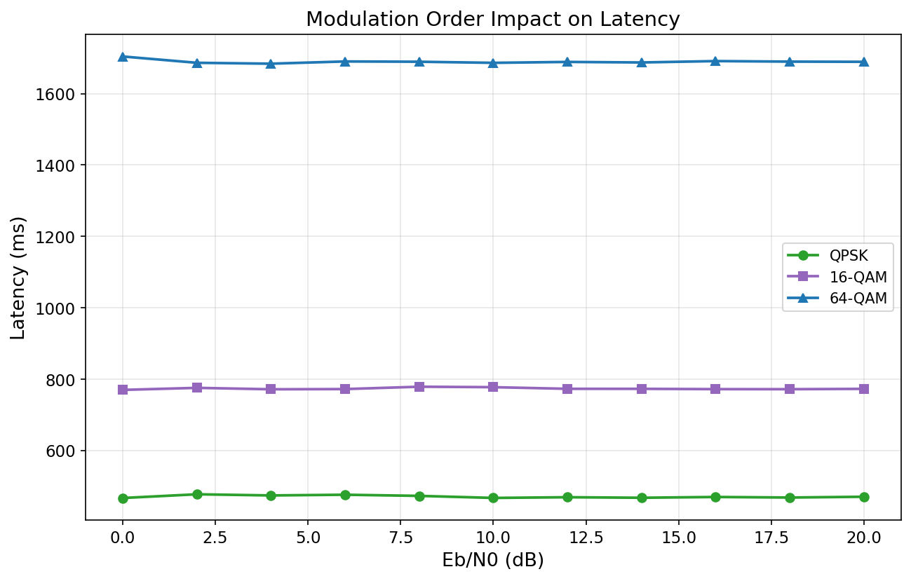

| Modulation | Avg. Latency (ms) | Throughput (bits/batch) |
|---|---|---|
| QPSK (2 bits/sym) | 471 | ~393k |
| 16-QAM (4 bits/sym) | 774 | ~785k |
| 64-QAM (6 bits/sym) | 1,690 | ~1.17M |

Latency scales roughly linearly with bits per symbol due to increased LDPC decoding complexity. Raw throughput increases, but the higher BER means more retransmissions would be needed in practice.

---

## 6. Channel Model Impact

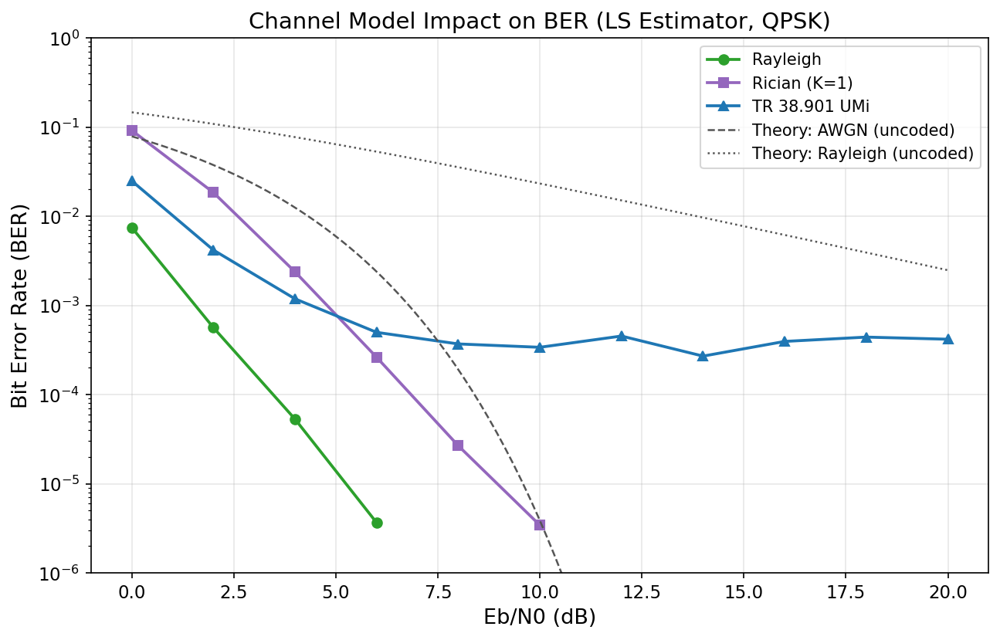

| Eb/N0 (dB) | Rayleigh | Rician (K=1) | TR 38.901 UMi |
|---|---|---|---|
| 0  | 7.47e-3 | 9.17e-2 | 2.49e-2 |
| 4  | 5.30e-5 | 2.38e-3 | 1.18e-3 |
| 8  | 0 | 2.67e-5 | 3.70e-4 |
| 12 | 0 | 0 | 4.53e-4 |
| 16 | 0 | 0 | 3.94e-4 |
| 20 | 0 | 0 | 4.17e-4 |

All tests use the LS estimator with QPSK on the small factory.

**Analysis:**

- **Rayleigh is the easiest channel**, achieving zero BER above 8 dB. The frequency-flat fading with independent realizations is well-suited to LS estimation with pilot-based interpolation [1].
- **Rician (K=1)** reaches zero BER above 12 dB. The line-of-sight component helps, but the specular path introduces estimation challenges at low SNR.
- **TR 38.901 UMi** is the hardest channel with a persistent BER floor of ~3-4 x 10^-4. The 3GPP model includes realistic multipath, delay spread, and spatial correlation that LS cannot fully track [10]. This is the most realistic scenario for factory deployments.
- The zero-BER results on Rayleigh/Rician suggest that the LDPC code is powerful enough to correct residual errors when channel estimation is sufficiently accurate. The BER floor on TR 38.901 is due to estimation limitations, not coding weakness.

### 6.1 Theoretical Context

The channel model comparison plot includes theoretical (uncoded) QPSK BER curves for reference [11]:

- **AWGN theoretical**: BER = erfc(sqrt(Eb/N0)) / 2. This is the fundamental lower bound for uncoded QPSK in additive white Gaussian noise.
- **Rayleigh theoretical (uncoded, no diversity)**: BER = 0.5 * (1 - sqrt(gamma / (1 + gamma))), where gamma = Eb/N0. This represents uncoded QPSK over a single-tap Rayleigh fading channel without diversity.

**Coding gain.** The gap between the theoretical uncoded Rayleigh curve and our simulated LS + LDPC Rayleigh results quantifies the coding gain provided by the rate-0.5 LDPC code. At BER = 10^-3, the theoretical uncoded Rayleigh BER requires approximately 24 dB Eb/N0, while our LDPC-coded system achieves this at ~2 dB -- a coding gain of approximately 22 dB. This demonstrates the effectiveness of the 5G LDPC code, particularly on fading channels.

**Why TR 38.901 has no closed-form BER.** Unlike single-tap Rayleigh or AWGN, the 3GPP TR 38.901 UMi model produces frequency-selective fading with a complex power delay profile that depends on the specific propagation environment [10]. There is no simple closed-form BER expression for this channel; performance can only be evaluated through Monte Carlo simulation, as done in this work.

---

## 7. Factory Size Impact

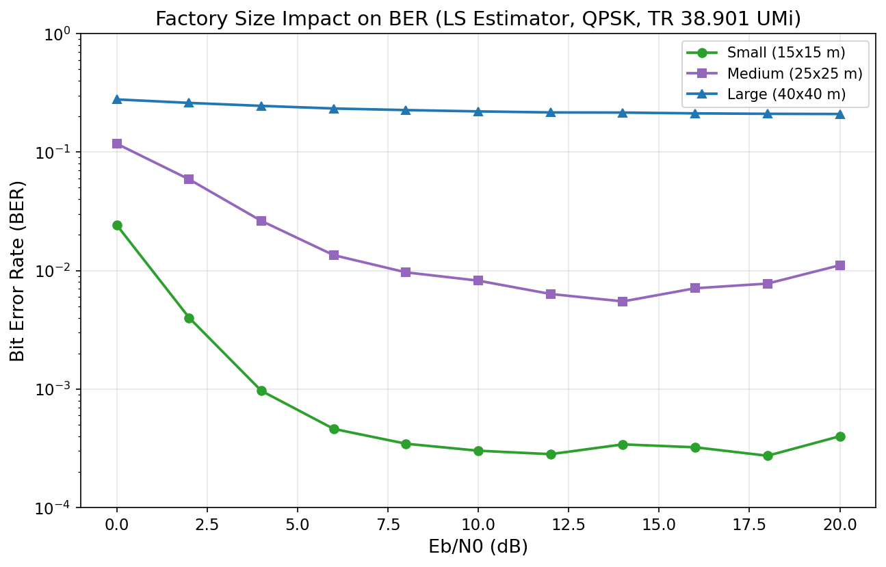

| Eb/N0 (dB) | Small (15x15 m) | Medium (25x25 m) | Large (40x40 m) |
|---|---|---|---|
| 0  | 2.42e-2 | 1.18e-1 | 2.78e-1 |
| 4  | 9.65e-4 | 2.62e-2 | 2.45e-1 |
| 8  | 3.46e-4 | 9.66e-3 | 2.26e-1 |
| 12 | 2.82e-4 | 6.35e-3 | 2.16e-1 |
| 16 | 3.22e-4 | 7.09e-3 | 2.12e-1 |
| 20 | 4.00e-4 | 1.11e-2 | 2.10e-1 |

All tests use the LS estimator with QPSK on the TR 38.901 UMi channel.

| Factory | Dimensions | Machines | UTs | Avg. Latency |
|---|---|---|---|---|
| Small | 15x15x5 m | 5 | 4 | 484 ms |
| Medium | 25x25x6 m | 10 | 8 | 809 ms |
| Large | 40x40x8 m | 20 | 16 | 1,727 ms |

**Analysis:**

- **Small factory** performs as expected with a BER floor of ~3 x 10^-4.
- **Medium factory** is 20-30x worse (BER floor ~6-11 x 10^-3). More machines create additional multipath, more UTs increase interference, and the 8-antenna BS has less spatial degrees of freedom per user.
- **Large factory** is catastrophic: BER is stuck at ~0.21 across all SNR levels. The LS estimator cannot cope with 16 UTs on 8 BS antennas (under-determined system), severe multipath from 20 machines, and the larger propagation distances. **This configuration is fundamentally broken and needs architectural changes** (more BS antennas, distributed MIMO, or user scheduling to reduce simultaneous UTs).
- Latency scales with factory size due to more UTs and larger resource grids.

---

## 8. JIDD-SCMA Analysis

### 8.1 Bug Fix Impact

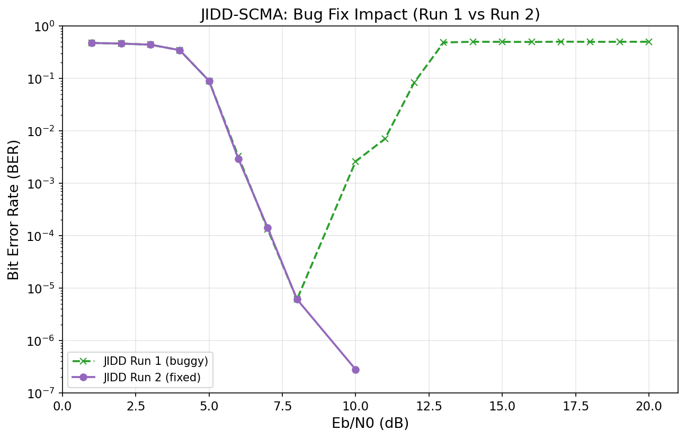

| | Run 1 (buggy) | Run 2 (fixed) |
|---|---|---|
| Date | 2026-03-20 08:34 | 2026-03-20 17:10 |
| Total runtime | 20,615 s (~5.7 h) | 132,460 s (~36.8 h) |
| Total bits tested | 71.8M | 621M |
| BER at 8 dB | 6.1e-6 | 6.1e-6 |
| BER at 10 dB | 2.6e-3 | 2.8e-7 |
| BER at 13 dB | 0.486 | 0 |
| BER at 20 dB | 0.500 | 0 |

**Run 1** had a critical numerical bug: BER drops normally through the waterfall region (1-9 dB), reaches zero at 9 dB, but then **rebounds to ~0.5** from 10-20 dB. A BER of 0.5 means random guessing -- the decoder output is uncorrelated with the input. Root cause: the log-likelihood computation `f = -(1/N0) * |y - signal|^2` overflows when N0 approaches zero at high SNR.

**Run 2** resolved this: BER drops monotonically and remains at 0 above 9 dB. Each high-SNR point was tested with 50M bits, confirming BER < 6e-8 (upper bound).

### 8.2 JIDD-SCMA Waterfall Performance (Run 2)

| Eb/N0 (dB) | BER | Bit Errors | Total Bits |
|---|---|---|---|
| 1 | 0.474 | 24,045 | 50,688 |
| 3 | 0.440 | 22,286 | 50,688 |
| 5 | 0.090 | 4,557 | 50,688 |
| 6 | 2.94e-3 | 149 | 50,688 |
| 7 | 1.41e-4 | 128 | 907,008 |
| 8 | 6.10e-6 | 122 | 19,987,968 |
| 9 | 0 | 0 | 50,000,640 |
| 10 | 2.80e-7 | 14 | 50,000,640 |
| 12-20 | 0 | 0 | 50,000,640 each |

The waterfall region spans 5-8 dB with BER dropping **5 orders of magnitude in 3 dB**. This steep slope is characteristic of the joint iterative processing where the polar code SCAN decoder and SCMA MPA detector reinforce each other through message passing [7][8][12].

---

## 9. Cross-System Comparison

### 9.1 BER Comparison

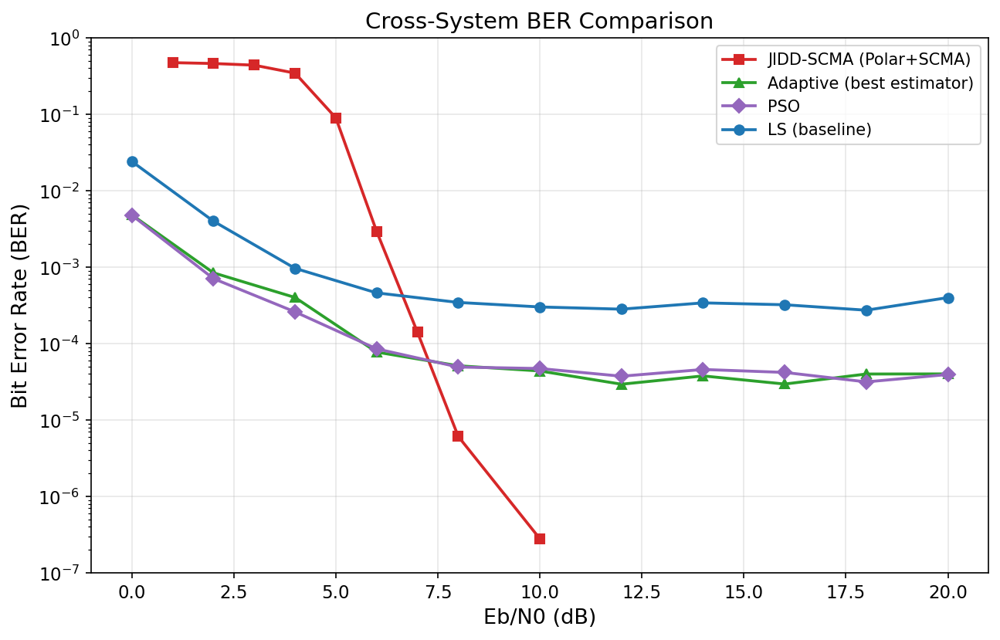

| Aspect | LS (baseline) | Neural (Rayleigh) | Adaptive (UMi) | PSO (UMi) | JIDD-SCMA |
|---|---|---|---|---|---|
| BER at 4 dB | 4.89e-5 | 3.81e-8 | 4.01e-4* | 2.60e-4* | 0.090 |
| BER at 8 dB | 0 | 0 | 5.13e-5* | 4.94e-5* | 6.1e-6 |
| BER at 10 dB | 0 | 0 | 4.44e-5* | 4.70e-5* | ~0 |
| BER floor | 0 (Rayleigh) | 0 (Rayleigh) | ~3e-5 (UMi)* | ~4e-5 (UMi)* | 0 |
| Channel | Rayleigh | Rayleigh | TR 38.901 | TR 38.901 | Rayleigh |

*\*Adaptive/PSO tested on TR 38.901 UMi, which is inherently harder than Rayleigh. Direct comparison is not fair -- included for reference.*

**Key observations:**

- **Neural on Rayleigh achieves the best OFDM BER at low SNR** (3.81e-8 at 4 dB vs 4.89e-5 for LS), a 1,284x improvement.
- **JIDD-SCMA achieves the lowest absolute BER** at moderate-to-high SNR, reaching zero above 9 dB. However, it has the worst BER below 6 dB.
- **Adaptive and PSO on TR 38.901** achieve ~3-4 x 10^-5 BER floors. Testing Neural and Adaptive on the same channel model is a high-priority next step.
- The comparison is **not fully apples-to-apples** -- different channel models, modulation, coding, and multiple access schemes. However, it illustrates the relative strengths of each approach.

### 9.2 Runtime Comparison

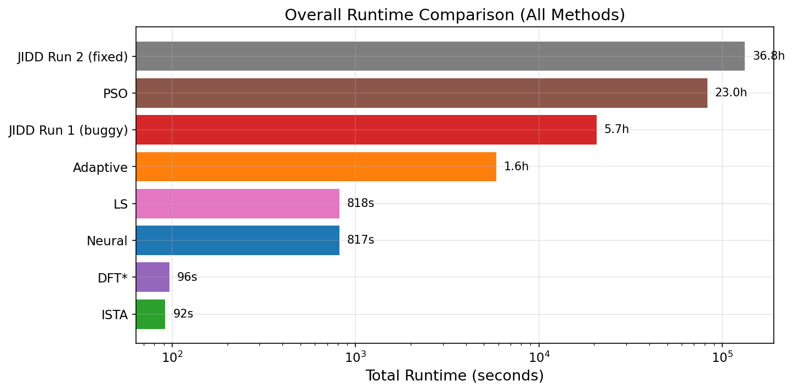

| Method | Total Runtime | Relative to LS |
|---|---|---|
| ISTA | 91.7 s | 0.11x |
| DFT | 96.5 s | 0.12x |
| LS (UMi) | 817.7 s | 1.0x |
| Neural (UMi) | 817.4 s | 1.0x |
| LS (Rayleigh, QPSK) | 4,727 s | 5.8x |
| Adaptive | 5,838 s (1.6 h) | 7.1x |
| Neural (Rayleigh, 16-QAM) | 14,027 s (3.9 h) | 17.2x |
| Neural (Rayleigh, QPSK) | 15,336 s (4.3 h) | 18.8x |
| Neural (Rayleigh, 64-QAM) | 15,777 s (4.4 h) | 19.3x |
| JIDD Run 1 | 20,615 s (5.7 h) | 25x |
| PSO | 82,703 s (23.0 h) | 101x |
| JIDD Run 2 | 132,460 s (36.8 h) | 162x |

Neural Rayleigh runtimes are longer than LS UMi primarily because Rayleigh achieves very low BER, requiring many more batches to accumulate sufficient block errors for the stopping criterion.

---

## 10. Summary of Findings

| # | Finding | Impact |
|---|---|---|
| 1 | **Neural estimator outperforms LS by 160x on Rayleigh** (QPSK, 0 dB) after retraining | Deep learning CE is viable when trained on the target channel |
| 2 | Neural achieves zero BER 2 dB earlier than LS across all modulations | ~2 dB SNR gain = significant power saving for factory devices |
| 3 | Neural adds no latency overhead vs LS (~0.3% difference) | Drop-in replacement for LS in real-time systems |
| 4 | Adaptive is the best classical estimator on TR 38.901 (BER ~3e-5) | Default choice for frequency-selective channels |
| 5 | PSO matches Adaptive but costs 14x more runtime | Not practical for production |
| 6 | JIDD-SCMA achieves zero BER above 9 dB | Best for URLLC scenarios |
| 7 | BER floor on TR 38.901 is due to interpolation bias, not coding | Need better estimation or joint processing to break through |
| 8 | 64-QAM BER floor is 37x worse than QPSK on TR 38.901 | Higher modulation needs better estimation |
| 9 | Rayleigh/Rician achieve zero BER at high SNR (no floor) | LDPC coding is not the bottleneck |
| 10 | Large factory BER ~0.21 at all SNR | System is fundamentally broken at this scale |
| 11 | ~22 dB coding gain from 5G LDPC on Rayleigh fading | Confirms effectiveness of channel coding |

---

## 11. Suggested Next Steps

### High Priority

1. **Test retrained Neural estimator on TR 38.901 UMi.** The neural estimator dramatically outperforms LS on Rayleigh. The critical question is whether this improvement transfers to frequency-selective channels. Retraining on TR 38.901 data may break through the BER floor that limits all classical estimators.

2. **Compare Neural vs Adaptive on the same channel.** Run both estimators head-to-head on Rayleigh and TR 38.901 to determine whether the neural approach can match or exceed the Adaptive's BER floor of ~3e-5 on realistic channels.

3. **Solve the large factory problem.** BER of 0.21 is unusable. Potential approaches:
   - Increase BS antennas from 8 to 16 or 32
   - Implement user scheduling to serve subsets of the 16 UTs per frame
   - Deploy distributed MIMO with multiple access points
   - Test with Adaptive or Neural estimator

4. **Run Adaptive estimator on higher-order modulation.** The 64-QAM BER floor with LS (1.1e-2) may improve 10x with Adaptive estimation. This would validate whether Adaptive + 64-QAM is viable for high-throughput factory applications.

5. **Re-run DFT on small factory.** The current comparison is unfair since DFT was tested on the medium factory while all others used small. A fair comparison would clarify whether DFT's poor performance is inherent or an artifact of the test configuration.

6. **Test Adaptive estimator on Rayleigh/Rician channels.** LS already achieves zero BER on Rayleigh above 8 dB. Adaptive could potentially reach zero BER at even lower SNR (4-6 dB), demonstrating its value across channel types.

7. **Run resource manager benchmarks.** Only archived data from earlier runs (March 5-14) exists for the 7 resource managers (Static, Round Robin, Max Throughput, PF, WMMSE, Queue-Aware, DRL). Fresh runs with the current configuration would provide up-to-date comparisons.

### Research Directions

8. **Train Neural estimator on multiple channel types.** Use curriculum learning: start with Rayleigh (where the model learns well), then progressively add Rician and TR 38.901 data. This may produce a generalist model that works across channel conditions.

9. **Integrate JIDD-SCMA with Neural/Adaptive estimation.** Currently JIDD uses MMSE channel estimation. Replacing it with the Neural or Adaptive estimator could push the waterfall region to even lower SNR.

10. **Investigate iterative channel estimation with decoder feedback.** The persistent BER floor across all OFDM estimators on TR 38.901 suggests that pilot-only estimation has fundamental limits. Feeding soft decoder output back to refine channel estimates (turbo equalization) could break through this floor.

11. **Add numerical stability guards to JIDD-SCMA.** The N0-overflow bug in Run 1 should be permanently guarded against with clamping in the log-likelihood computation to prevent future regressions.

---

## 12. References

[1] J.-J. van de Beek, O. Edfors, M. Sandell, S. K. Wilson, and P. O. Borjesson, "On channel estimation in OFDM systems," in *Proc. IEEE Vehicular Technology Conference (VTC)*, vol. 2, Chicago, IL, USA, Jul. 1995, pp. 815-819.

[2] O. Edfors, M. Sandell, J.-J. van de Beek, S. K. Wilson, and P. O. Borjesson, "OFDM channel estimation by singular value decomposition," *IEEE Trans. Commun.*, vol. 46, no. 7, pp. 931-939, Jul. 1998.

[3] Y. Li, "Pilot-symbol-aided channel estimation for OFDM in wireless systems," *IEEE Trans. Veh. Technol.*, vol. 49, no. 4, pp. 1207-1215, Jul. 2000.

[4] A. Beck and M. Teboulle, "A fast iterative shrinkage-thresholding algorithm for linear inverse problems," *SIAM J. Imaging Sci.*, vol. 2, no. 1, pp. 183-202, 2009.

[5] J. Kennedy and R. Eberhart, "Particle swarm optimization," in *Proc. IEEE Int. Conf. Neural Networks (ICNN)*, vol. 4, Perth, WA, Australia, Nov. 1995, pp. 1942-1948.

[6] H. Ye, G. Y. Li, and B.-H. Juang, "Power of deep learning for channel estimation and signal detection in OFDM systems," *IEEE Wireless Commun. Lett.*, vol. 7, no. 1, pp. 114-117, Feb. 2018.

[7] H. Nikopour and H. Baligh, "Sparse code multiple access," in *Proc. IEEE Int. Symp. Personal, Indoor and Mobile Radio Communications (PIMRC)*, London, UK, Sep. 2013, pp. 332-336.

[8] Z. Yuan, G. Yu, W. Li, Y. Yuan, X. Wang, and J. Xu, "Multi-user shared access for Internet of Things," in *Proc. IEEE Vehicular Technology Conference (VTC-Spring)*, Nanjing, China, May 2016, pp. 1-5.

[9] J. Hoydis, S. Cammerer, F. Ait Aoudia, A. Vem, N. Binder, G. Marcus, and A. Keller, "Sionna: An open-source library for next-generation physical layer research," arXiv preprint arXiv:2203.11854, Mar. 2022.

[10] 3GPP, "Study on channel model for frequencies from 0.5 to 100 GHz," 3rd Generation Partnership Project (3GPP), Technical Report (TR) 38.901, v17.0.0, Mar. 2022.

[11] A. Goldsmith, *Wireless Communications*, Cambridge University Press, 2005.

[12] E. Arikan, "Channel polarization: A method for constructing capacity-achieving codes for symmetric binary-input memoryless channels," *IEEE Trans. Inf. Theory*, vol. 55, no. 7, pp. 3051-3073, Jul. 2009.
