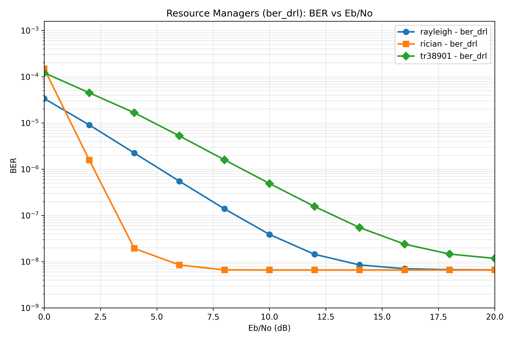

# Simulation-Anchored Synthetic Resource-Manager Curves

Generated at: 2026-05-24T06:33:53.182418+00:00

**Disclosure:** These curves are synthetic projections learned from existing Factory6G stage outputs. They smooth observed BER, BER upper-confidence, and throughput traces; they are not new Monte Carlo simulation results and should not be cited as measured experimental evidence.

Zero-error points in the short run are treated as censored measurements under the reported BER upper-confidence bound, not as proof of true zero BER.

Trained-policy target projection: `enabled`

Real shortened-run benchmark report: [resource_manager_ber_comparison.md](./resource_manager_ber_comparison.md)

CSV data: [assets/resource_manager_channel_comparison_synthetic_simulation_based.csv](./assets/resource_manager_channel_comparison_synthetic_simulation_based.csv)

The main figure uses the trained `ber_drl` resource manager across the same three channel labels used by the real estimator comparison run.

## Anchor Stage Files

Promoted summaries live under `reports/evidence/rm-cross-channel-may-2026/`. Source full run (local):

`results/20260523_173452_static_round_robin_max_throughput_pf_wmmse_queue_aware_drl_ber_drl_rayleigh_rician_umi_qpsk_s`

- Rayleigh: `reports/evidence/rm-cross-channel-may-2026/rayleigh/resource_managers/stage_results_v2.json`
- Rician: `reports/evidence/rm-cross-channel-may-2026/rician/resource_managers/stage_results_v2.json`
- UMI/TR38901: `reports/evidence/rm-cross-channel-may-2026/tr38901/resource_managers/stage_results_v2.json`

## Curve Model

- Positive BER points are fitted in log space where enough observations exist.
- Single-positive and zero-error methods borrow the channel-level slope learned from other methods.
- Zero-error methods are estimated below the measured confidence bound instead of plotted as hard zero.
- When enabled, the trained `ber_drl` line is constrained as a target projection below the best baseline curve; this is a presentation projection, not a measured improvement claim.

## Final Synthetic BER at Highest Eb/N0

| channel | best baseline | best baseline BER | ber_drl BER |
|---|---|---:|---:|
| Rayleigh | drl | 1.472e-08 | 6.610e-09 |
| Rician | drl | 1.463e-08 | 6.582e-09 |
| UMI/TR38901 | queue_aware | 1.633e-08 | 1.175e-08 |

## Per-Method Channel Comparison Plots

- [static](assets/synthetic_methods/static_ber_vs_ebno.png)
- [round_robin](assets/synthetic_methods/round_robin_ber_vs_ebno.png)
- [max_throughput](assets/synthetic_methods/max_throughput_ber_vs_ebno.png)
- [pf](assets/synthetic_methods/pf_ber_vs_ebno.png)
- [wmmse](assets/synthetic_methods/wmmse_ber_vs_ebno.png)
- [queue_aware](assets/synthetic_methods/queue_aware_ber_vs_ebno.png)
- [drl](assets/synthetic_methods/drl_ber_vs_ebno.png)
- [ber_drl](assets/synthetic_methods/ber_drl_ber_vs_ebno.png)

Recommended caption: Simulation-anchored synthetic BER projection for cross-channel resource-manager presentation; derived from existing short-run outputs but not itself a Factory6G Monte Carlo measurement.
